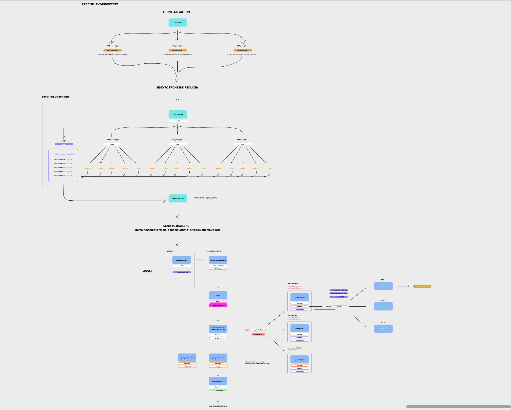
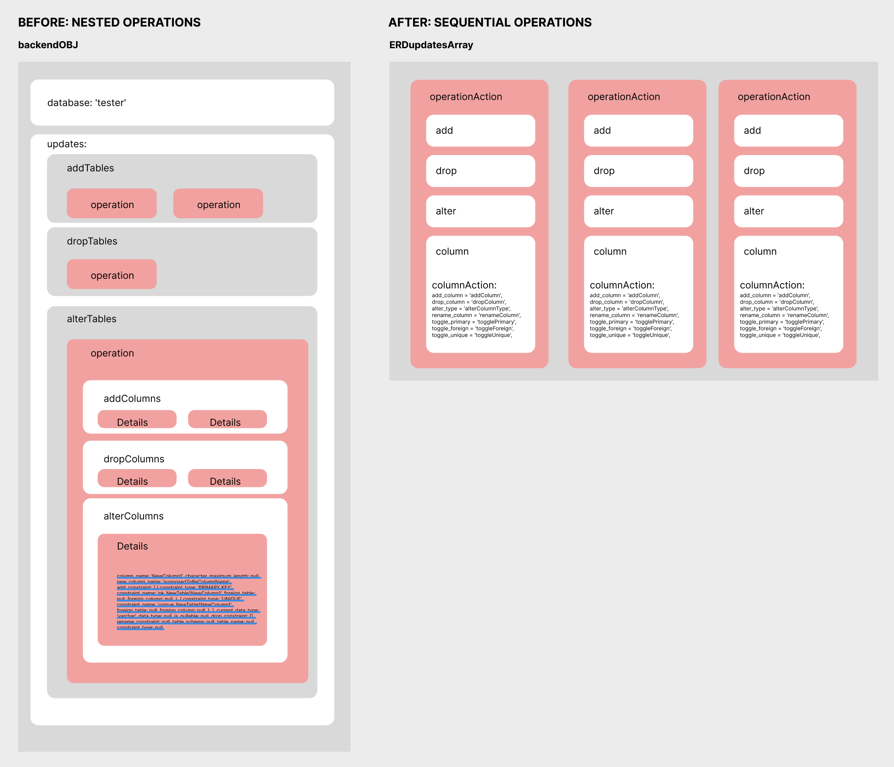

<b>`Developer's Read Me`</b>

<b>`** v14.0.0 **`</b>

In this version our team focused on debugging and refactoring the code base from all prior versions. 

<b> WHAT YOU NEED TO DO FIRST: </b>

Run npm run dev twice if you do not manually run tsc to compile the files first. The ts files have to compile before electron-dev and webpack-dev can start. 
<code>npm run install</code> 
<code>npm run postinstall</code> 
<code>npm run build</code> 
<code>npm run dev</code> or <code>npm run start</code>(this is more stable but no hot module reloading)

<b> WHAT WE UPDATED: </b>

1. Refactored UI to enhance user's experience by improving readability and predictability.

2. Updated deprecated or unsupported dependencies and fixed breaking changes to ensure application remains easy to maintain and improve.  
-  NOTE: DO NOT UPDATE the “fixPath” PACKAGE! It will break the app. 

3. Started the migration from Context API to Redux Toolkit for state management, ensuring future scaling and maintainability.  
- Three slices have been created to replace old reducers.

4. Fixed Database Authentication for MySql, Postgres, RDS MySql and RDS Postgres.

5. Added additional testing suites to improve the tests coverage.

6. Enforced Typescript typing where it was missing.

7. Moved all reusable types into one location to prevent duplication.

<b> WHAT NEEDS TO BE DONE: </b>

 1. Finishing the migration of state management to Redux Toolkit.  Context API is not a good way to manage state in an increasingly complex app. 

 2. New testing for the Redux frontend. Improve test coverage overall for the rest of the application. 

 3. There needs to be a continuous audit for old deprecated code. Things like “event” are deprecated for ‘e’ in React and some files are still using old code since we did not get to audit it. 

 4. Typescript needs to be enforced. There are certain parts of the codebase that do not use Typescript typing and it should be rectified with refactoring. 

 5. Old code is commented out. Some files contain a lot of commented out code which need to be addressed by either deleting or fixing the issues with it. 

 6. If it is 12/2024 or after Electron has probably ended support for version 30 of Electron and an update will need to be done. 

 7. Since the dependency update some MUI components have outdated props that will have to be changed 

 8. As migration of Redux is complete old files need to be deleted from state management. (comparing total old file size to new file size could be a good metric)

 9. ESLint config should be migrated to an es.config.js file (Low priority)

10. Refactor tableTabBar Component 
- Migrated ERTabling to tableTabBar component to access the ERD because it lacked a parent compartment for prop drilling, hindering the addition of new features. Going forward, a more maintainable solution should be implemented like Redux or Zustand.

11. Isolating Database  One of the biggest tasks that we tried but <b>did not finish</b> is isolating the concerns of each database type (DBType). The current application has multiple

<code>if (database === DBType.postgres) {} 
else if (database === DBType.mysql) {} 
else (database === DBType.sqlite) {} 
</code>
 

situations and it is not good. instead we will use switch statements to preemptively throw operations into separate functions to completely silo cases for Postgres, Mysql, and SqLite. This is a task for <b>BOTH THE FRONTEND AND BACKEND</b> and the <b>FRONTEND IS MUCH HARDER</b>. The work for backend is actually done and it is illustrated in the picture below 

The road map is finish connecting the siloed pieces for postgres, then moving on to mysql    <b>***Important***   There is no entry for this system yet, but this file frontend/components/iews/ERTables/ERDisplayWindow.tsx will be the entry once completed</b>

12. ERD Logic Update Currently, previous wrote the frontend to send back a big bundle of all the operations done in the frontend ERD Table. This ERD table object is divided by add, drop, and alter. All the add operations will execute first then drop, then alter. This is <b>BAD</b>.    We need to redesign frontend to send back "sequental" operations instead of bundling operations by add, drop, alter because it takes care of multiple edge cases and users in the front can do as many operations they want to ensure <b>SAVE</b> works. I illustrated the problem below. The current backend is written out already. We just need to make sure the frontend is send back the appropriate logic

   <b>**_Important_**   This is written at backend/src/ipcHandlers/dbCRUDHandlerERD.ts and will replace backend/src/ipcHandlers/dbCRUDHandler.ts when this is ready</b>

13. Async event emmiters between front/backend

Currently, the way the feedback modal works is by handling events that are emitted from both the frontend and the backend. Ideally, this should be refactored to be state dependent rather than event dependent, as it controls the display of the modal. This can be tied into the centralized async event emitter added to frontend/components/app.tsx, in conjunction with migration to reducers from state variables. The goal will be to house modal messages in the store tied to the main app reducer. From there, the async handler can send new messages to the state via main app dispatch, and any other front end feedback can do the same.  
The main roadblock in the way of finalizing the transfer of event handlers out of the frontend is the way the dblist (list of databases in the sidebar) gets updated. Many event handlers in the backend send a dblist update event out to update the front end. Ideally, this should be handled by returning the new dblist changes out of the handler and using that resolved value to update state whenever an action would cause a dblist change. Right now, app.tsx has a useEffect running that listens for those dblist updates every frame. This is inefficient as a frontend concern.  
The spinner currently works in a similar way to feedback. Once all async is completely migrated (including dblist update changes), this spinner can simply be tied to the loading property in the main app state.  
There are still some filesystem read/write calls in the front end. This should be refactored to an async call that requests the backend handle the file system read/write for proper separation of concerns.

<b> WHAT IS BROKEN: </b>

1. The application on Windows may periodically crash.

2. There are import issues on Mac computers.

- Unable to import pg or mySQL database files

4. Cannot currently make a new Query, selecting queries from a database view will crash the application.

4a. Duplicates appear on previous queries.

- In 'queryView', the 'queriesRan' state is defined, set, and passed down as a prop to its child component 'queryHistory'. On line 54 of 'queryHistory', duplicate query saved in the queriesRan state are removed. However, there's a problem: when we click the format button in QuerySqlInput and then run the query, it saves the query again. This happens because the new Set method doesn't recognize the formatted SQL strings due to the presence of '\n' characters. Consequently, clicking the run query button for both unformatted and formatted SQL strings results in duplicates being saved in the query history.

5. SQLite was never fully implemented as a supported database and is currently only a copy of PSQL

6. Column manipulation is not working in the application (adding, modifying, deleting etc.). We expect the  
migration to Redux may have changed things unexpectedly or other code was never finished. Reference v11 for working code.

7. Devtools do not currently work with Electron due to Manifest V2 being deprecated by Chrome and no update by Electron to  
 support Manifest V3. Built in chrome devtool only thing available.

8. Label and Group field disappears.

- In the queries tab, the Label and Group text in input field will disappear when selecting the Monaco Editor.
- The bug may arise from the useEffect hook, which triggers every time the component updates. Any changes detected in the editor results in a new Monaco Editor instance, potentially resetting the label and group text inputs.

9. Foreign and Primary keys.

- Unable to select the primary and/or foreign key of a newly added column until the column is saved onto the database. Once saved onto the database, we can then select the primary and foreign key and save them onto the database.
