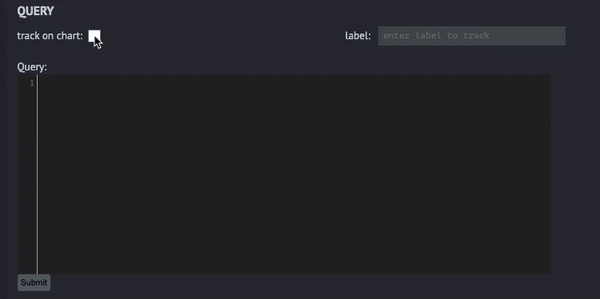
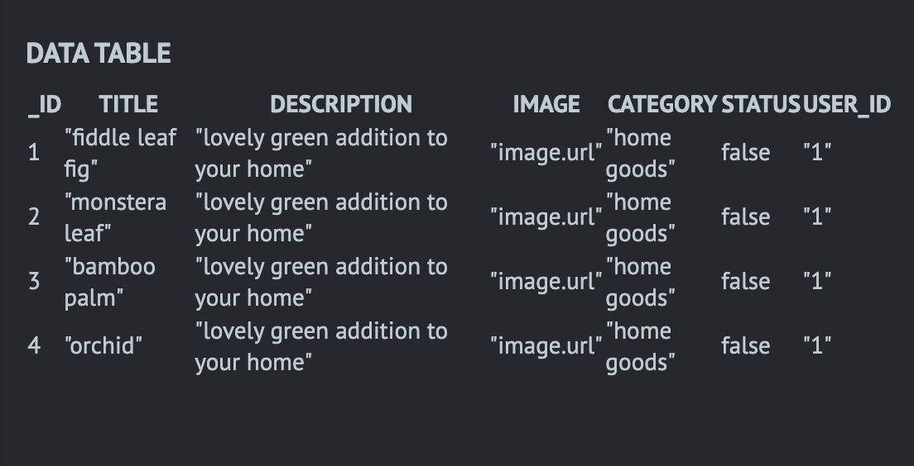
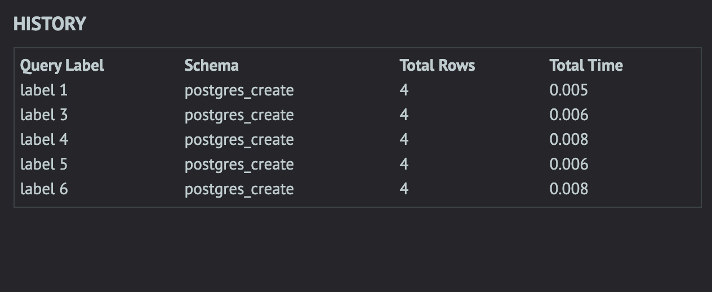
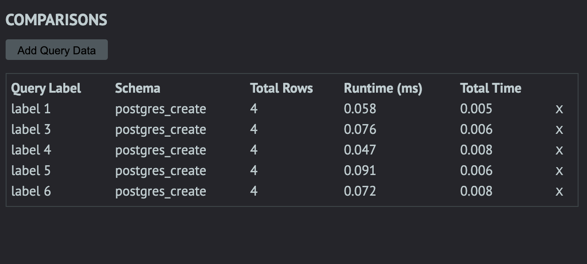
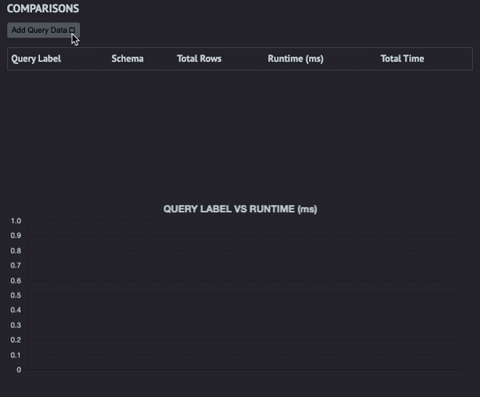

<div align="center">


[](https://github.com/oslabs-beta/SeeQR)


[](https://twitter.com/theseeqr)
[](https://github.com/oslabs-beta/SeeQR)
[theSeeQR.io](http://www.theseeqr.io)

<p><b>SeeQR: </b>A database analytic tool that compares the efficiency of different schemas and queries on a granular level to make better informed architectural decisions regarding SQL databases at various scales.</p>

</div>

## Table of Contents

- [Beta Phase](#beta-phase)
- [Getting Started](#getting-started)
- [Built With](#built-with)
- [Interface & Features](#interface-&-features)
  - Schema upload methods
  - Query input
  - Data
  - History
  - Results
  - Compare
  - Dummy data generation
  - Visualized Analytics
- [Application Architecture and Logic](#application-architecture-and-logic)
- [Testing](#testing)
- [Core Team](#core-team)

## Beta Phase

SeeQR is still in BETA. Additional features, extensions, and improvements will continue to be introduced. If you encounter any issues with the application, please report them in the issues tab or submit a PR. Thank you for your interest!

## Getting Started

To get started on contributing to this project:

1. Download and Install [Docker Desktop](https://www.docker.com/get-started)
2. Fork or clone this repository
3. Npm install
   1. Run `npm install` for application-specific dependencies.
   2. Run global install for: `'cross-env'`, `'webpack'`, `'webpack-dev-server'`, `'electron'`, and `'typescript'`.
4. Install [Live Sass Compile](https://github.com/ritwickdey/vscode-live-sass-compiler) VSCode extension (settings are configured in the .vscode file in this repo), or set up your preferred Sass compiler
5. To run application during development
   1. `npm run dev` to launch Electron application window and webpack-dev-server.
   2. `npm run resetContainer` to reset the container and clear pre-existing SeeQR databases. If error “can’t find postgres-1” is encountered, it is simply an indication that the container is already pruned.

## Built With

- [Electron](https://www.electronjs.org/docs)
- [React](https://reactjs.org/)
- [React-Hooks](https://reactjs.org/docs/hooks-intro.html)
- [Typescript](https://www.typescriptlang.org/)
- [Docker](https://www.docker.com/get-started)
- [Docker-Compose](https://docs.docker.com/compose/)
- [PostgreSQL](https://www.postgresql.org/)
- [Chart.js](https://github.com/chartjs)
- [Faker.js](https://github.com/Marak/faker.js)
- [CodeMirror](https://codemirror.net/)

## Interface & Features
<div align="center">
<br /><br /><p>The whole interface in a nutshell</p>
</div>

- Schema
  - Upon application launch, upload `.sql` or `.tar` file when prompted by splash page, or hit cancel.
  - The uploaded `.sql` or `.tar` file becomes the active database.
  - To input new schemas, toggle the “Input Schema” button. Upload a .sql or .tar file or directly input schema code. Remember to provide the schema with a unique label, as it will be assigned to the name property of the newly spun up database connected to the schema.

- Query input

  - The center panel is where the query input text field is located, utilizing CodeMirror for SQL styling.
  - Users have option to execute a tracked or untracked query—simply check the box and provide a label to identify the query in later comparisons against other queries.
  - Toggle the submit button in the bottom left to send the query to the selected database.
  <br /><br />
<div align="center">

</div>
<br /><br />

- Data

  - The data table displays data returned by the inputted query.
<div align="center">
<br /><br />
</div>

- Input Schema and Tabs
  - New schemas can be uploaded into the application by clicking the "+" button above the main panel in the form of a ```.sql``` or a ```.tar``` file.
  - Users can also make a copy of an existing schema, with or without data included.
  - Newly uploaded schemas are displayed as tabs, which can be activated to run tests against during application session.
<div align="center">
  
</div>

- Generate Dummy Data
  - Users can generate dummy data to fill in a selected scheama's tables—currently supported data types are:
    - INT, SMALLINT, and BIGINT
    - please fill in
  - Dummy data is foreign-key complaint.
    - please fill in the details
<div align="center">
  
</div>

- History

  - The history table shows the latest queries the user submitted irrespective of the database.
  - The history table also displays the total rows returned by the query and the total query execution time.
<div align="center">

</div>

- Compare

  - The comparison table is flexible to the user’s preferences.
  - The user selects which queries they want to compare side by side from the ‘Add Query Data’ drop down.
  - They can add and remove queries as they see fit.

<div align="center">

</div>

- Visualized Analytics

  - Upon each query execution, query runtime displays under the "Query Label vs Query Runtime" graph. Graph automatically interpolates as results enumerate.
  - User may toggle on specific query analytics results with the Comparisons panel to compare query performances.
  - Graph will be organized on x-axis by label, and colored by schema.

<div align="center">

</div>

## Application Architecture and Logic

<b>Containerization</b><br/>
SeeQR streamlines the process of instantiating postgres databases by leveraging Docker to containerize an image of postgres. This means instances of databases are automatically created every time new schema data is uploaded or inputted via the SeeQR GUI. Electron communicates with the instantiated database’s URI’s by taking advantage of the `'pg'` npm package.

<b>Cross-schema Comparisons</b><br/>
One of the key features of SeeQR is to compare the efficiency of executing user-inputted queries against different schemas. This allows customization of table scale, relationship, type, and the queries themselves within the context of each schema. This flexibility affords the user granular adjustments for testing every desired scenario. Please refer to “Interface & Functionality” for more details on execution.

<b>Database:Schema 1:1 Architecture</b><br/>
While it is feasible for a database to house multiple schemas, SeeQR’s default architecture for database:schema relations is 1:1. For every schema inputted, a new database is generated to hold that schema. This architecture serves the application’s central purpose: testing — by enabling the capacity to individually scale data connected to each schema, generating analytics at any user-specified conditions.

<b>Session-based Result Caching</b><br/>
The outcome results from each query, both retrieved data and analytics, are stored in the application’s state, which can be viewed and compared in table and visualizer formats. Note that these results’ persistence is session-based and will be cleared upon quitting the application.

## Core Team

<table>
<tr>
<td align="center">
<br/>
<a href="https://github.com/catherinechiu">Catherine Chiu</a>
</td>
<td align="center">
<br/>
<a href="https://github.com/serenackuo">Serena Kuo</a>
</td>
<td align="center">
<br/>
<a href="https://github.com/FrankNorton32">Frank Norton</a>
</td>
<td align="center">
<br/>
<a href="https://github.com/mercerstronck">Mercer Stronck</a>
</td>
<td align="center">
<br/>
<a href="https://github.com/muhammadtrad">Muhammad Trad</a>
</td>
</tr></table>
