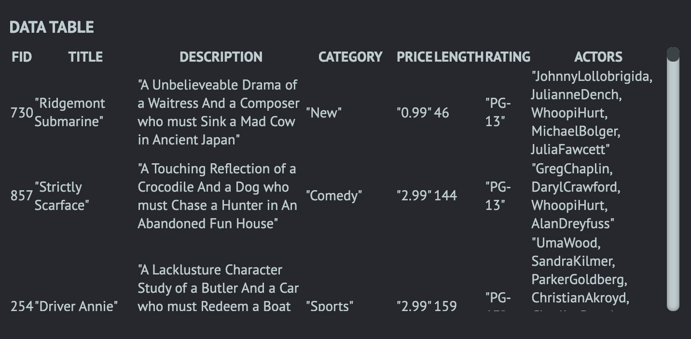
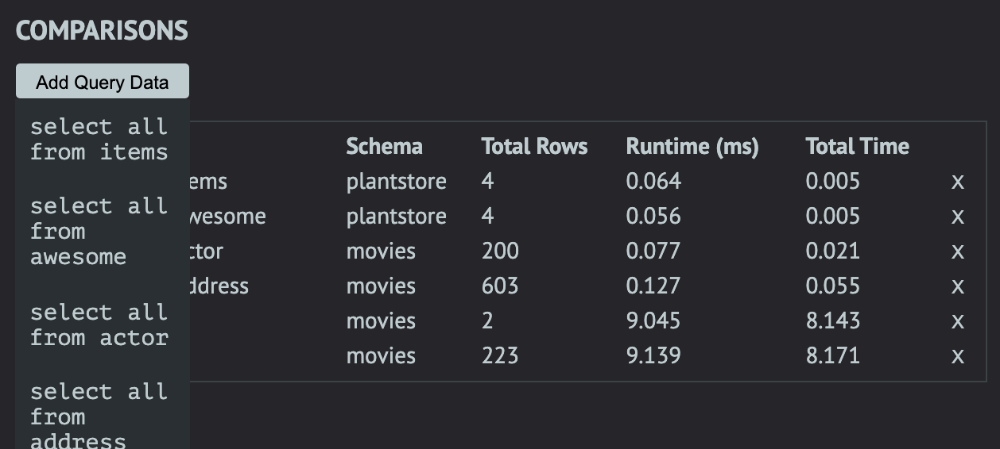

[theSeeQR.io](http://www.theseeqr.io)

<b>SeeQR: </b>A database analytic tool to compare the efficiency of different schemas and queries on a granular level so that developers/architects can make better informed architectural decisions regarding SQL databases at various scales.

## Table of Contents

- [Table of Contents](#table-of-contents)
- [Beta Phase](#beta-phase)
- [Getting Started](#getting-started)
- [Built With](#built-with)
- [Interface & Features](#interface--features)
- [Application Architecture and Logic](#application-architecture-and-logic)
- [Core Team](#core-team)

## Beta Phase

SeeQR is still in BETA. Additional features, extensions, and improvements will continue to be introduced. If you encounter any issues with the application, please report them in the issues tab or submit a PR. Thank you for your interest!

## Getting Started

To get started on contributing to this project:

1. Download and install [Postgres.app](https://postgresapp.com/) and start it before opening up SeeQR
2. Fork or clone this repository
3. Npm install
   1. Run `npm install` for application-specific dependencies
   2. Run global install for: `'cross-env'`, `'webpack'`, `'webpack-dev-server'`, `'electron'`, and `'typescript'`
4. Install [Live Sass Compile](https://github.com/ritwickdey/vscode-live-sass-compiler) VSCode extension (settings are configured in the .vscode file in this repo), or set up your preferred Sass compiler
5. To run application during development
   1. `npm run dev` to launch the Electron application window and webpack-dev-server

## Built With

- [Electron](https://www.electronjs.org/docs)
- [React](https://reactjs.org/)
- [React-Hooks](https://reactjs.org/docs/hooks-intro.html)
- [React Flow] (https://reactflow.dev/)
- [Typescript](https://www.typescriptlang.org/)
- [PostgreSQL](https://www.postgresql.org/)
- [Material-UI] (https://material-ui.com/)
- [styled-components] (https://styled-components.com/)
- [Chart.js](https://github.com/chartjs)
- [Faker.js](https://github.com/Marak/faker.js)
- [CodeMirror](https://codemirror.net/)

## Interface & Features

  
The whole interface in a nutshell

- Schema

  - Upon application launch, select the desired database to connect to or follow the quick-start guide to get started
  - The application connects to the local instance of PostgreSQL, so all databases that the role 'Postgres' has access to are available
  - Besides using the existing databases, the application also provides options to create new databases by importing `.sql` files, running queries, or copying an existing database, with or without its data

- Query input

  - In the 'Queries' view, the main panel is where the query input text field is located, utilizing CodeMirror. The paint button in the top right corner of the panel auto-formats the inputted query
  - Users can select the database to use in the 'Database' field above the main panel
  - Users also have the option to execute a labelled or unlabelled query — simply provide a label in the 'Label' field above the main panel to identify the query in later comparisons against other queries
    - Please note that only labelled queries will be saved in the current session for future references
  - To execute the query, simply select the 'RUN QUERY' button at the bottom of the panel or press 'Ctrl-Enter' on the keyboard
    
  

  
  

- Data

  - Once executed, the query's output will be displayed. In addition, for eligible queries, users will be able to view the queries' planning time, execution time, and plan of execution
    - Eligible queries include any `SELECT`, `INSERT`, `UPDATE`, `DELETE`, `VALUES`, `EXECUTE`, `DECLARE`, `CREATE TABLE AS`, or `CREATE MATERIALIZED VIEW AS` statement
  - Users can toggle between the executed query's 'RESULTS' and 'EXECUTION PLAN'
  - The 'RESULTS' view displays the executed query's returned results
  - The 'EXECUTION PLAN' view displays the executed query's plan of execution
    - Within the 'EXECUTION PLAN', users can adjust the thresholds used to highlight certain nodes in the tree
  - To execute a new query, simply select the '+' button in the sidebar

  

    
  

- Generate Dummy Data

  - Users can generate up to 500,000 rows of foreign-key compliant dummy-data
  - Currently supported data types are:
    - INT
    - SMALLINT
    - BIGINT
    - VARCHAR
    - BOOLEAN
    - DATE
    
  

    
  

- History

  - The history table shows the latest queries the user submitted irrespective of the database.
  - The history table also displays the total rows returned by the query and the total query execution time.
  

  
  

- Compare

  - The comparison table is flexible to the user’s preferences.
  - The user selects which queries they want to compare side by side from the ‘Add Query Data’ drop down.
  - They can add and remove queries as they see fit.

- Visualized Analytics

  - Upon each query execution, query runtime displays under the "Query Label vs Query Runtime" graph. Graph automatically interpolates as results enumerate.
  - User may toggle on specific query analytics results with the Comparisons panel to compare query performances.
  - Graph will be organized on x-axis by label, and colored by schema.

## Application Architecture and Logic

<b>Sandbox Environment</b> 
SeeQR streamlines the process of instantiating postgres databases by leveraging Postgres.app to import a copy of your database in postgres on your local machine. This means instances of databases are automatically created every time new schema data is uploaded or inputted via the SeeQR GUI. Electron communicates with the instantiated database’s URIs by taking advantage of the `'pg'` npm package.

<b>Cross-schema Comparisons</b> 
One of the key features of SeeQR is to compare the efficiency of executing user-inputted queries against different schemas. This allows customization of table scale, relationship, type, and the queries themselves within the context of each schema. This flexibility affords the user granular adjustments for testing every desired scenario. Please refer to “Interface & Functionality” for more details on execution.

<b>Database:Schema 1:1 Architecture</b> 
While it is feasible for a database to house multiple schemas, SeeQR’s default architecture for database:schema relations is 1:1. For every schema inputted, a new database is generated to hold that schema. This architecture serves the application’s central purpose: testing — by enabling the capacity to individually scale data connected to each schema, generating analytics at any user-specified conditions.

<b>Session-based Result Caching</b> 
The outcome results from each query, both retrieved data and analytics, are stored in the application’s state, which can be viewed and compared in table and visualizer formats. Note that these results’ persistence is session-based and will be cleared upon quitting the application.

## Core Team

<table>
<tr>
<td align="center">
 
<a href="https://github.com/catherinechiu">Catherine Chiu</a>
</td>
<td align="center">
 
<a href="https://github.com/serenackuo">Serena Kuo</a>
</td>
<td align="center">
 
<a href="https://github.com/FrankNorton32">Frank Norton</a>
</td>
<td align="center">
 
<a href="https://github.com/mercerstronck">Mercer Stronck</a>
</td>
<td align="center">
 
<a href="https://github.com/muhammadtrad">Muhammad Trad</a>
</td>
</tr></table>

<table align="center">
<td align="center">
 
<a href="https://github.com/justinD-A">Justin Dury-Agri</a>
</td>
<td align="center">
 
<a href="https://github.com/caseyescovedo">Casey Escovedo</a>
</td>
<td align="center">
 
<a href="https://github.com/frakes413">Sam Frakes</a>
</td>
<td align="center">
 
<a href="https://github.com/cwalker3011">Casey Walker</a>
</td>
</table>

<table align="center">
<td align="center">
 
<a href="https://github.com/chrisakinrinade">Chris Akinrinade</a>
</td>
<td align="center">
 
<a href="https://github.com/dkolotouros">James Kolotouros</a>
</td>
<td align="center">
 
<a href="https://github.com/jcourtner">Jennifer Courtner</a>
</td>
<td align="center">
 
<a href="https://github.com/kklochan">Katie Klochan</a>
</td>
</table>
