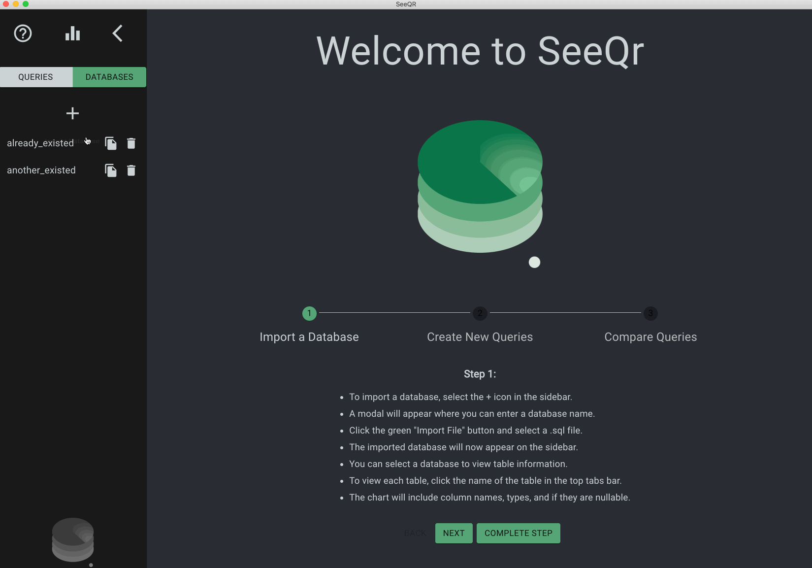
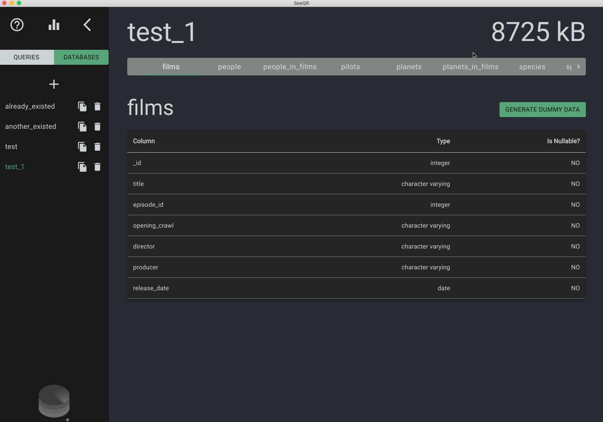
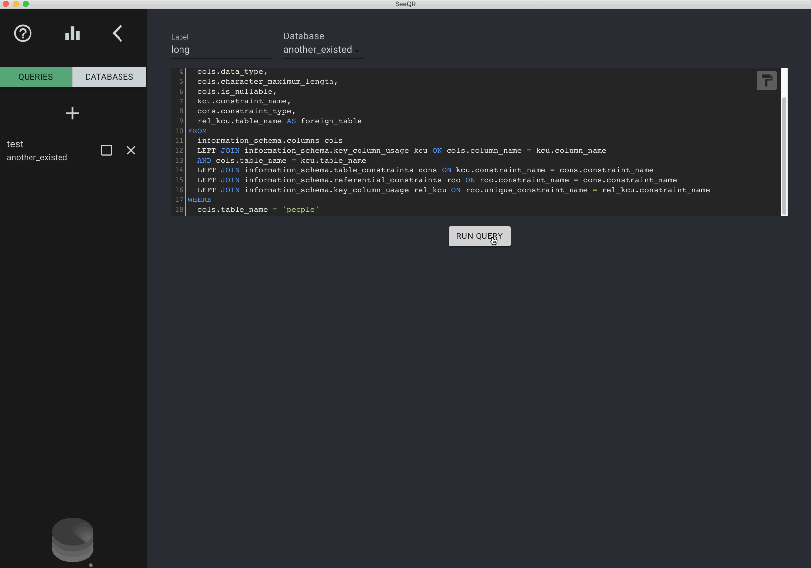
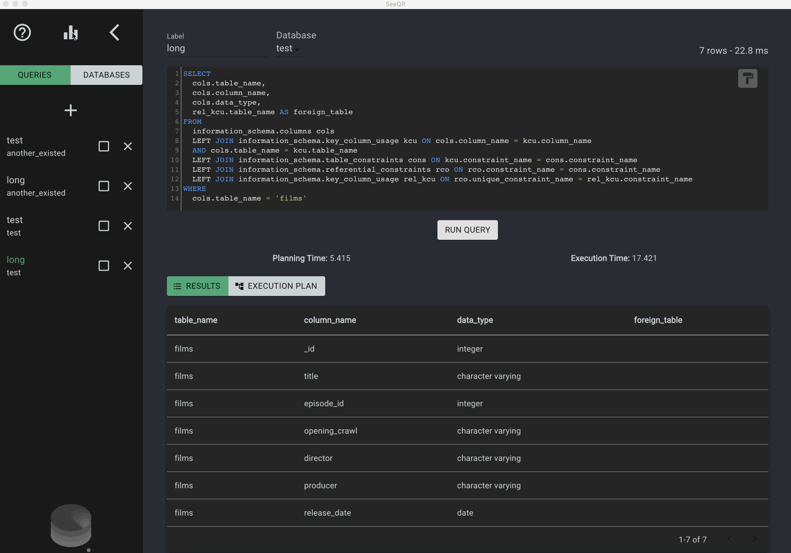

[theSeeQR.io](http://www.theseeqr.io)

<b>SeeQR: </b>A database analytic tool to compare the efficiency of different schemas and queries on a granular level so that developers/architects can make better informed architectural decisions regarding SQL databases at various scales.

## Table of Contents

- [Table of Contents](#table-of-contents)
- [Getting Started](#getting-started)
- [Built With](#built-with)
- [Interface & Features](#interface--features)
- [Application Architecture and Logic](#application-architecture-and-logic)
- [Contributing](#contributing)
- [Core Team](#core-team)

## Getting Started

To get started on contributing to this project:

1. Download and install [Postgres.app](https://postgresapp.com/) and start it before opening up SeeQR
2. Fork or clone this repository
3. Npm install
   1. Run `npm install` for application-specific dependencies
   2. Run global install for: `'cross-env'`, `'webpack'`, `'webpack-dev-server'`, `'electron'`, and `'typescript'`
4. Install [Live Sass Compile](https://github.com/ritwickdey/vscode-live-sass-compiler) VSCode extension (settings are configured in the .vscode file in this repo), or set up your preferred Sass compiler
5. To run application during development
   1. `npm run dev` to launch the Electron application window and webpack-dev-server

## Built With

- [Electron](https://www.electronjs.org/docs)
- [React](https://reactjs.org/)
- [React-Hooks](https://reactjs.org/docs/hooks-intro.html)
- [Typescript](https://www.typescriptlang.org/)
- [PostgreSQL](https://www.postgresql.org/)
- [styled-components](https://styled-components.com/)
- [Material-UI](https://material-ui.com/)
- [React-Flow](https://reactflow.dev/)
- [Chart.js](https://github.com/chartjs)
- [Faker.js](https://github.com/Marak/faker.js)
- [CodeMirror](https://codemirror.net/)

## Interface & Features

- Overview

  - Upon application launch, select the desired database to connect to or follow the quick-start guide to get started
  - The application connects to the local instance of PostgreSQL using the role 'Postgres', so all databases that 'Postgres' has access to are available
  - Besides using the existing databases, the application also provides various options to create new databases:
      - Importing `.sql` or `.tar` files
      - Manually running `CREATE DATABASE` queries in SeeQR
      - Copying an existing database (with or without original data)
  - Users can toggle between the 'DATABASES' view and the 'QUERIES' view

  

- Databases

  - In the 'DATABASES' view, users can select a table from a list of all the tables in the schema of the currently selected database
  - Information about the selected table is then displayed
  - The name and size of the selected database are also displayed at the top of the page
  - Users can also generate up to 500,000 rows of foreign-key compliant dummy data at a time for the selected table in the current database. Currently supported data types are:
    - INT
    - SMALLINT
    - BIGINT
    - VARCHAR
    - BOOLEAN
    - DATE
  
   
  

    
  

- Queries

  - In the 'QUERIES' view, the main panel is where the query input text field is located, utilizing CodeMirror. The paint button in the top right corner of the panel auto-formats the inputted query
  - Users can select the database to use in the 'Database' dropdown above the main panel
  - Users also have the option to execute a labelled or unlabelled query — simply provide a label in the 'Label' field above the main panel to identify the query in later comparisons against other queries
    - Please note that only labelled queries will be saved in the current session for future references
  - To execute the query, simply select the 'RUN QUERY' button at the bottom of the panel or press 'Ctrl-Enter' on the keyboard

   
  

    
  

- Data

  - Once executed, the query's output will be displayed. In addition, for eligible queries, users will be able to view the queries' planning time, execution time, total run time, and plan of execution
    - Eligible queries include any `SELECT`, `INSERT`, `UPDATE`, `DELETE`, `VALUES`, `EXECUTE`, `DECLARE`, `CREATE TABLE AS`, or `CREATE MATERIALIZED VIEW AS` statement
  - Users can toggle between the executed query's 'RESULTS' and 'EXECUTION PLAN'
  - The 'RESULTS' view displays the executed query's returned results
  - The 'EXECUTION PLAN' view displays the executed query's plan of execution
    - Within the 'EXECUTION PLAN', users can adjust the thresholds used to highlight certain nodes in the tree
    - Clicking on a node will display additioanl details regarding that action as well
  - To execute a new query, simply select the '+' button in the sidebar. To go back to a previously saved query, just select it in the sidebar

   
  

    
  

- Compare

  - Click on the 'bar graph' icon at the top of the sidebar to get to the 'Compare Queries' view
  - The comparison table is flexible to the user’s preferences as the user selects which queries to compare side by side
  - Simply check or uncheck the box next to each saved query to add or remove the query from the graph
  - Graph will be organized along the x-axis by label, and colored by schema
  - Aside from the visualized performance comparison of the selected queries, a table will display information about each selected query, including its total run time and performance relative to other queries with the same label, with the most performant query highlighted 

  

## Application Architecture and Logic

<b>Sandbox Environment</b> 
SeeQR streamlines the process of instantiating postgres databases by leveraging Postgres.app to create your database in postgres on your local machine. This means instances of databases are automatically created every time new schema data is uploaded or inputted via the SeeQR GUI. Electron communicates with the instantiated database’s URIs by taking advantage of the `'pg'` npm package.

<b>Cross-schema Comparisons</b> 
One of the key features of SeeQR is to compare the efficiency of executing user-inputted queries against different schemas. This allows customization of table scale, relationship, type, and the queries themselves within the context of each schema. This flexibility affords the user granular adjustments for testing every desired scenario. Please refer to “Interface & Features” for more details on execution.

<b>Database:Schema 1:1 Architecture</b> 
While it is feasible for a database to house multiple schemas, SeeQR’s default architecture for database:schema relations is 1:1. For every schema inputted, a new database is generated to hold that schema. This architecture serves the application’s central purpose: testing — by enabling the capacity to individually scale data connected to each schema, generating analytics at any user-specified conditions.

<b>Session-based Result Caching</b> 
The outcome results from each query, both retrieved data and analytics, are stored in the application’s state, which can be viewed and compared in table and visualizer formats. Note that these results’ persistence is session-based and will be cleared upon quitting the application.

## Contributing

We've released SeeQR because it's a helpful tool to help optimize SQL databases. Additional features, extensions, and improvements will continue to be introduced. We are thankful for any contributions from the community and we encourage you to try SeeQR out and make or suggest improvements where you see fit! If you encounter any issues with the application, please report them in the issues tab or submit a PR. Thank you for your interest!

## Core Team

| [Casey Escovedo](https://github.com/caseyescovedo) | [Casey Walker](https://github.com/cwalker3011) | [Catherine Chiu](https://github.com/catherinechiu) | [Chris Akinrinade](https://github.com/chrisakinrinade) | [Cindy Chau](https://github.com/cindychau) | [Claudio Santos](https://github.com/Claudiohbsantos) | [Faraz Akhtar](https://github.com/faraza22) | [Frank Norton](https://github.com/FrankNorton32) | [James Kolotouros](https://github.com/dkolotouros) | [Jennifer Courtner](https://github.com/jcourtner) | [Justin Dury-Agri](https://github.com/justinD-A) | [Katie Klochan](https://github.com/kklochan) | [Mercer Stronck](https://github.com/mercerstronck) | [Muhammad Trad](https://github.com/muhammadtrad) | [Richard Lam](https://github.com/rlam108) | [Sam Frakes](https://github.com/frakes413) | [Serena Kuo](https://github.com/serenackuo) |

## License

SeeQR is <a href="./LICENSE">MIT licensed</a>.

