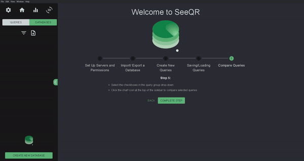
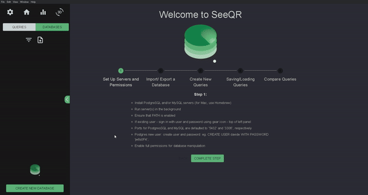
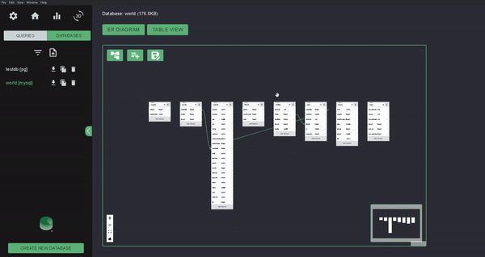
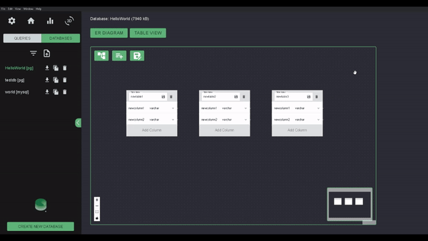
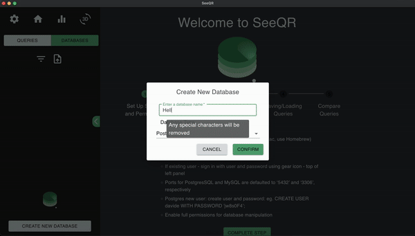
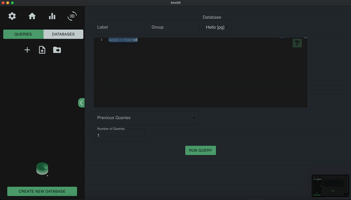
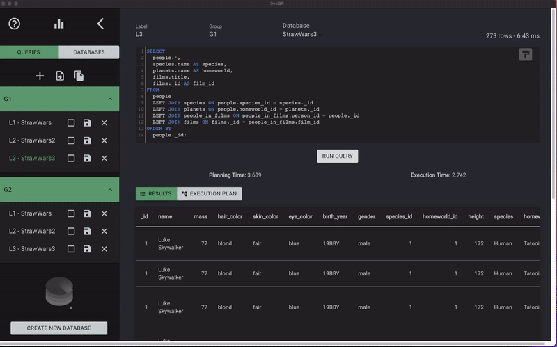
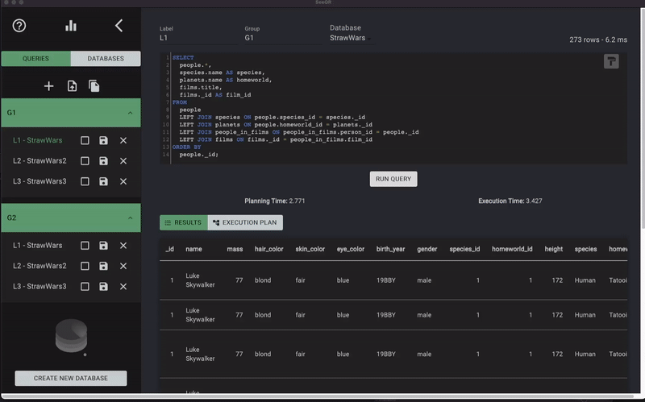
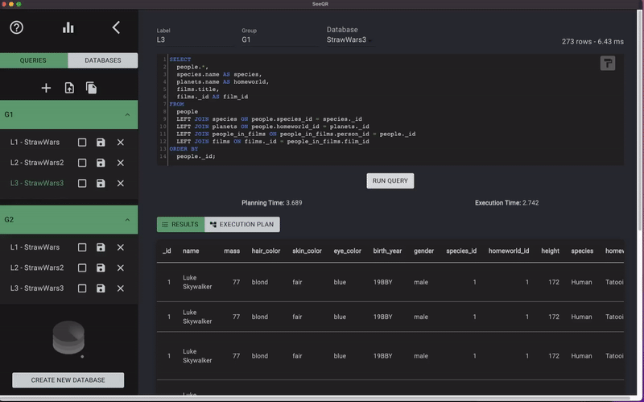

[seeqrapp.com](http://www.seeqrapp.com)

SeeQR is a <b>convenient one-stop shop</b> for efficient SQL database manipulation and performance testing. SeeQR can be used throughout the database lifecycle, from creation to testing.

### For the latest in-depth docs for v14.0.0, please visit our [docs site](http://www.seeqrapp.com/docs).

## Table of Contents

- [Table of Contents](#table-of-contents)
- [Getting Started](#getting-started)
- [Built With](#built-with)
- [Interface \& Features](#interface--features)
- [Application Architecture and Logic](#application-architecture-and-logic)
- [Contributing](#contributing)
- [Core Team](#core-team)
- [License](#license)

## Getting Started

To get started on contributing and editing databases to this project:

1. Download and install [Postgres](https://www.postgresql.org/download/) to access SeeQR's Postgres features and/or [MySQL](https://dev.mysql.com/downloads/mysql/) to access its MySQL features.
2. Ensure that psql and/or mysql are available in the `$PATH`.
3. Create users with passwords and permissions for both [PostgreSQL](https://phoenixnap.com/kb/postgres-create-user) and [MySQL](https://www.digitalocean.com/community/tutorials/how-to-create-a-new-user-and-grant-permissions-in-mysql). Linked are instructions for Mac (Homebrew) and Linux/WSL.
4. Download the latest version of [SeeQR](https://github.com/open-source-labs/seeqr/releases/latest).

## Built With

- [Electron](https://www.electronjs.org/docs)
- [React](https://reactjs.org/)
- [React-Redux](https://react-redux.js.org/)
- [Typescript](https://www.typescriptlang.org/)
- [PostgreSQL](https://www.postgresql.org/)
- [MySQL](https://www.mysql.com/)
- [styled-components](https://styled-components.com/)
- [Material-UI](https://material-ui.com/)
- [React-Flow](https://reactflow.dev/)
- [Chart.js](https://github.com/chartjs)
- [Faker.js](https://github.com/Marak/faker.js)
- [Monaco](https://microsoft.github.io/monaco-editor/)
- [React-Force-Graph](https://github.com/vasturiano/react-force-graph)
- [Three.js](https://github.com/mrdoob/three.js/)
- [D3.js](https://github.com/d3/d3)
- [Three-Spritetext](https://github.com/vasturiano/three-spritetext)

## Interface & Features

- Overview
  - Upon application launch, navigate to the config menu by clicking on the gear icon on the top left.
  - Ensure that your usernames, passwords, and ports are accurate in the SeeQR config.
  - Besides using the existing databases, the application also provides various options to create new databases:
    - Importing `.sql` or `.tar` files.
    - Navigating to the `Create Database` view at bottom of sidebar.
    - Copying an existing database (with or without original data).
  - Users can export any database onto their local machine.
  - Users can toggle between the 'DATABASES' view and the 'QUERIES' view.
  - Users can toggle between an 'ER DIAGRAM' view and the 'TABLES' view for each database.

  
  

- Databases

  - In the 'DATABASES' view, an interactive Entity Relationship Diagram (`ER DIAGRAM`) is displayed for the selected database.

    - Users can now save table layout in version 13.
       

      

        
      

  - Users can select `TABLE` to see selected database in tabular form.

    - Users can select a table from a list of all the tables in the schema of the currently selected database.

      - Information about the selected table is then displayed.
      - The name and size of the selected database are also displayed at the top of the page.
      - Users can also generate large amounts of foreign-key compliant dummy data for the selected table in the current database. Currently supported data types are:

        - INT
        - BIGINT
        - VARCHAR
        - BOOLEAN
        - DATE

           
          

            
          

         

- 3D Database Visualization
  - From the 'DATABASES' view, select the '3D View' tab on the far right of the sidebar to launch the brand new 3D database visualizer.
    - Individual table nodes are distinguished by their different colors
    - Column nodes are joined to table nodes and match their source table color
    - Individual tables related by foreign keys are connected through their respective foreign and primary keys
  - Navigate through the 3D space using left click to rotate, scroll wheel to zoom, and right click to pan.
  - Click and drag nodes to visually organize them
  - Click on a table or column node to quickly view the data stored within
   
  

    
  

   
  

    
  

   
  

    
  

 

- Create/Edit Database
  - Users can create a new database from scratch by clicking the `Create New Database` button at the bottom of the sidebar.
  - Users can modify the newly created database as well as any existing databases using the `ER Diagram` to create/change/delete tables and columns.
  - The `Export` button will write a .sql file on the user's desktop of the selected database.

 

    
  

- Queries

  - In the 'QUERIES' view, the main panel is where the query input text field is located, utilizing Monaco. The paint button in the top right corner of the panel auto-formats the inputted query.
  - Users can select the database to use in the 'Database' dropdown above the main panel.
  - Users also have the option to execute a labelled/grouped or unlabelled/ungrouped query — simply provide a label/group in the 'Label'/'Group' field above the main panel to identify the query in later comparisons against other queries.
    - Please note that only labelled queries will be saved in the current session for future references.
  - To execute the query, simply select the 'RUN QUERY' button at the bottom of the panel or press 'Ctrl-Enter' on the keyboard.
  - Users have the option to run multiple queries, allowing users to obtain more reliable testing results.
  - Version 13 introduces a new feature that enables users to access and view previous queries. Upon selecting a previous query, it populates the query input field, allowing users to make edits before executing.
     
     
    

      

  

    

- Save/Load Queries

  - In the 'QUERIES' view, the file upload icon will open a file explorer window to select a .JSON to import query data from.
  - The file icon to the right of the upload icon will designate the file path to save query data to if you press the save button on the queries.
  - To save individual query data press the save icon on the individual queries in the dropdowns.

   
  

    
  

- Data

  - Once executed, the query's output will be displayed. In addition, for eligible queries, users will be able to view the queries' planning time, execution time, total run time, and plan of execution.
    - Eligible queries include any `SELECT`, `INSERT`, `UPDATE`, `DELETE`, `VALUES`, `EXECUTE`, `DECLARE`, `CREATE TABLE AS`, or `CREATE MATERIALIZED VIEW AS` statement.
  - Users can toggle between the executed query's 'RESULTS' and 'EXECUTION PLAN'.
  - The 'RESULTS' view displays the executed query's returned results.
  - The 'EXECUTION PLAN' view displays the executed query's plan of execution.
    - Within the 'EXECUTION PLAN', users can adjust the thresholds of 'Percentage of Total Duration' and the 'Planner Rows Accuracy' that are used to highlight certain nodes in the tree.
      - The 'Percentage of Total Duration' threshold is used to highlight the nodes whose durations are higher than the set limit, indicating that these nodes may be areas of improvement.
      - The 'Planner Rows Accuracy' threshold is used to highlight the nodes for which the planner's estimate number of rows differs from the actual number of rows, indicating that the database might need vacuuming.
    - Clicking on a node will display additional details regarding that action as well.
  - To execute a new query, simply select the '+' button in the sidebar. To go back to a previously saved query, just select it in the sidebar.

   
  

    
  

- Compare

  - Click on the 'bar graph' icon at the top of the sidebar to get to the 'Compare Queries' view.
  - The comparison table is flexible to the user’s preferences as the user selects which queries to compare side by side.
  - Simply check or uncheck the box next to each saved query to add or remove the query from the graph.
  - Graph will be organized along the x-axis by group, and colored by schema.
  - Aside from the visualized performance comparison of the selected queries, a table will display information about each selected query, including its total run time and performance relative to other queries with the same label, with the most performant query highlighted.

  

## Application Architecture and Logic

<b>Cross-Database Comparisons</b> 
One of the key features of SeeQR is to compare the efficiency of executing user-inputted queries against different databases. This allows customization of table scale, relationship, type, and the queries themselves within the context of each database. This flexibility affords the user granular adjustments for testing every desired scenario. Please refer to “Interface & Features” for more details on execution.

<b>Session-based Result Caching</b> 
The outcome results from each query, both retrieved data and analytics, are stored in the application’s state, which can be viewed and compared in table and visualizer formats. Note that these results’ persistence is session-based and will be cleared upon quitting the application.

## Contributing

We've released SeeQR because it's a useful tool to help optimize SQL databases. Additional features, extensions, and improvements will continue to be introduced. Please refer to the [DEV_README](https://github.com/open-source-labs/SeeQR/blob/main/DEV_README.md) for a list of improvements we are looking to implement and that are open to contributors.

We are thankful for any contributions from the community and we encourage you to try SeeQR out to make or suggest improvements where you see fit! If you encounter any issues with the application, please report them in the issues tab or submit a PR. Thank you for your interest!

## Core Team

[Zhijiao Li](https://github.com/lovelyjoy1991) | [Ting Li](https://github.com/Tingg-v1) | [Michael Ma](https://github.com/michaelma7) | [Ivan Navarro](https://github.com/navaiva) | [Joseph Cho](https://github.com/jocho5) | [Kevin Chou](https://github.com/choukevin612) |[Zoren Labrador](https://github.com/zorenal) |[Elaine Wong](https://github.com/user-byte123) | [Cathy Luong](https://github.com/cyliang93) | [Derek Koh](https://github.com/derekoko) | [Peter Zepf](https://github.com/peterzepf) | [Tony Gao](https://github.com/tgao17) | [Ching-Yuan Lai (Eric)](https://github.com/paranoidFrappe) | [Jamie Zhang](https://github.com/haemie) | [Julian Macalalag](https://github.com/juzi3) | [Nathan Chong](https://github.com/nathanhchong) | [Junaid Ahmed](https://github.com/junaid-ahmed7) | [Chase Sizemore](https://github.com/ChaseSizemore) | [Oscar Romero](https://github.com/creaturenex) | [Anthony Deng](https://github.com/anthonyadeng) | [Aya Moosa](https://github.com/Hiya-its-Aya) | [Trevor Ferguson](https://github.com/TrevorJFerguson) | [Pauline Nguyen](https://github.com/paulinekpn) | [Utkarsh Uppal](https://github.com/utyvert) | [Fred Jeong](https://github.com/fred-jeong) | [Gabriel Kime](https://github.com/wizardbusiness) | [Chris Fryer](github.com/frynoceros) | [Ian Grepo](https://github.com/RadiantGH) | [Michelle Chang](https://github.com/mkchang168) | [Jake Bradbeer](https://github.com/JBradbeer) | [Bryan Santos](https://github.com/santosb93) | [William Trey Lewis](https://github.com/treyfrog128) | [Brandon Lee](https://github.com/BrandonW-Lee) | [Casey Escovedo](https://github.com/caseyescovedo) | [Casey Walker](https://github.com/cwalker3011) | [Catherine Chiu](https://github.com/catherinechiu) | [Chris Akinrinade](https://github.com/chrisakinrinade) | [Cindy Chau](https://github.com/cindychau) | [Claudio Santos](https://github.com/Claudiohbsantos) | [Eric Han](https://github.com/ericJH92) | [Faraz Akhtar](https://github.com/faraza22) | [Frank Norton](https://github.com/FrankNorton32) | [Harrison Nam](https://github.com/harrynam07) | [James Kolotouros](https://github.com/dkolotouros) | [Jennifer Courtner](https://github.com/jcourtner) | [John Wagner](https://github.com/jwagner988) | [Justin Dury-Agri](https://github.com/justinD-A) | [Justin Hicks](https://github.com/JuiceBawks) | [Katie Klochan](https://github.com/kklochan) | [May Wirapa Boonyasurat](https://github.com/mimiwrp) | [Mercer Stronck](https://github.com/mercerstronck) | [Muhammad Trad](https://github.com/muhammadtrad) | [Richard Guo](https://github.com/richardguoo) | [Richard Lam](https://github.com/rlam108) | [Sam Frakes](https://github.com/frakes413) | [Serena Kuo](https://github.com/serenackuo) | [Timothy Sin](https://github.com/timothysin) | [Vincent Trang](https://github.com/vincentt114)

## License

SeeQR is <a href="./LICENSE">MIT licensed</a>.

